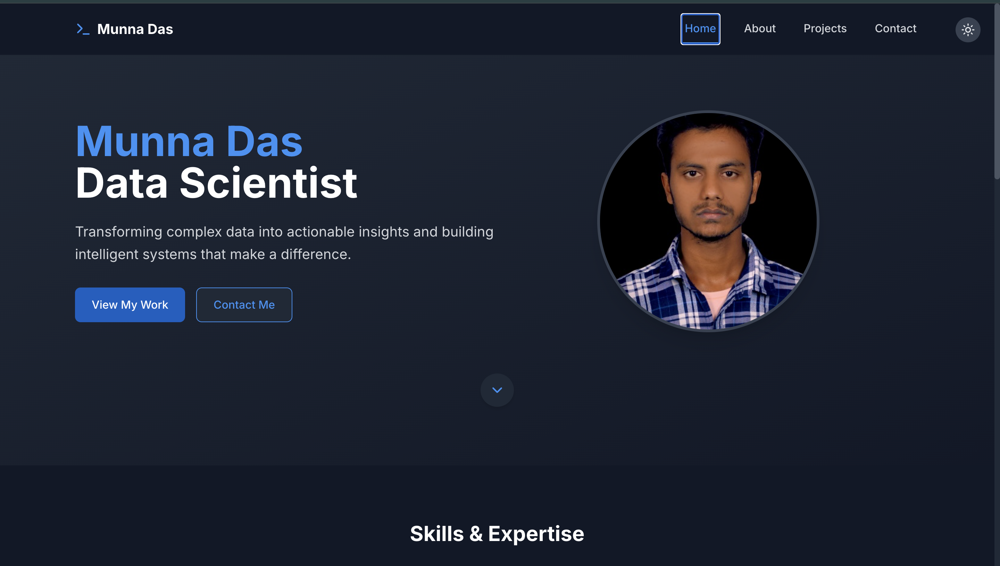

# Munna Das - Data Scientist Portfolio



A modern, responsive portfolio website built with React, TypeScript, and Tailwind CSS, showcasing my expertise in Data Science and Machine Learning.

## 🌟 Features

- **Responsive Design**: Fully responsive layout that works seamlessly across all devices
- **Dark Mode**: Automatic and manual dark mode switching with system preference detection
- **Modern UI**: Clean and professional interface with smooth animations
- **Interactive Components**: Dynamic project filtering and interactive elements
- **Performance Optimized**: Fast loading times and optimized assets
- **Secure**: Implements best practices for web security

## 🔒 Security Features

- **Content Security Policy**: Prevents XSS attacks and unauthorized resource loading
- **Protected Code**: MIT licensed to protect intellectual property
- **Secure Forms**: Implements form validation and sanitization
- **No Sensitive Data**: Ensures no sensitive information is exposed in the source code

## 🚀 Technologies Used

- React 18
- TypeScript
- Tailwind CSS
- Vite
- Lucide Icons

## 🛠️ Installation & Setup

1. Clone the repository
   ```bash
   git clone https://github.com/dasmrpmunna/portfolio.git
   ```

2. Install dependencies
   ```bash
   npm install
   ```

3. Start the development server
   ```bash
   npm run dev
   ```

4. Build for production
   ```bash
   npm run build
   ```

## 📱 Key Features

### Home Page
- Professional introduction
- Skills overview
- Featured projects
- Call-to-action sections

### About Page
- Detailed professional background
- Education history
- Work experience
- Skills and certifications

### Projects Page
- Filterable project gallery
- Project categorization
- Detailed project descriptions
- Live demo and source code links

### Contact Page
- Contact form
- Professional contact information
- Social media links
- FAQ section

## 🎨 Customization

The website uses Tailwind CSS for styling, making it easy to customize:

- Colors can be modified in `tailwind.config.js`
- Component styles are defined using Tailwind classes
- Dark mode is fully customizable
- Responsive breakpoints can be adjusted

## ⚖️ Legal & License

This project is protected under the MIT License. This means:

- ✅ You can use this code for personal and commercial projects
- ✅ You can modify and distribute the code
- ✅ You must include the original license and copyright notice
- ❌ The author is not liable for any damages
- ❌ No warranty is provided

See the [LICENSE](LICENSE) file for the full legal text.

## 🚫 Usage Restrictions

While this is an open-source project under the MIT License, please note:

1. The personal information, images, and content are proprietary and should be replaced with your own
2. The design can be used as a template, but direct copying of the portfolio content is not permitted
3. If you use this template, please provide attribution in your README or documentation

## 🤝 Contact

Munna Das - [LinkedIn](https://www.linkedin.com/in/dasmrpmunna)

Project Link: [https://github.com/dasmrpmunna/portfolio](https://github.com/dasmrpmunna/portfolio)

## 🙏 Acknowledgments

- [React](https://reactjs.org/)
- [Tailwind CSS](https://tailwindcss.com/)
- [Vite](https://vitejs.dev/)
- [Lucide Icons](https://lucide.dev/)

## 📢 Attribution

If you use this template, please include the following attribution in your README:

```markdown
This portfolio is based on a template by Munna Das (https://github.com/dasmrpmunna/portfolio)
```